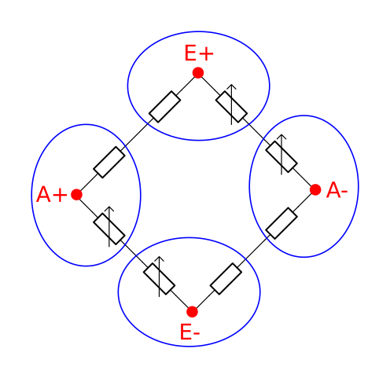

# HX711 Board

* RATE Pin connected to GND -> 10 Hz mode
* X1 Pin connected to GND -> on-chip oscillator is activate

## InteractiveHtmlBom

[Link to interactive bom](https://htmlpreview.github.io/?https://raw.githubusercontent.com/RT-CUSTOMZ/CoffeeScale-HW/master/bom/ibom.html)

## Schematics

[Link to Schematic pdf](./coffee-scale.pdf )

## Messbrücke

